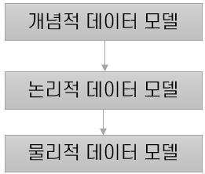
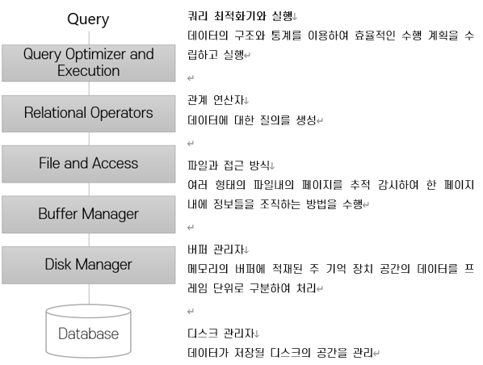

# Module 01

## 데이터베이스 개요

**CRUD**

- Create
- Read (Retrieve)
- Update
- Delete

### SQL

- **Set-oriented** Language
- 동일한 데이터를 허용하지 않음.
- RDBMS에서 사용
    - Oracle
    - MsSQL
    - MySQL
    - PostgreSQL

### NoSQL

- RDBMS를 사용하지 않는다는 의미가 아닌, 여러 유형의 데이터베이스를 사용하는 것
- 종류
    - Key-Value → Redis
    - Document → MongoDB
    - Column-Store
    - Graph → Facebook 친구추천
    

## 관계형 데이터베이스(RDBMS)와 관련하여 알아야 할 것들


## 데이터와 정보

- **데이터 (Data)**
    - 현실 세계로부터 단순한 관찰이나 측정을 통해서 수집된 사실(fact)이나 값(value)
- **정보 (Inforamtion)**
    - 의사 결정을 할 수 있게 하는 지식(knowledge)
    - 데이터 해석 또는 데이터간의 관계

$$
I = P(D)
$$


- 데이터에서 정보를 추출하는 방법을 데이터 처리(Data Processing)
- 넓은 의미로 정보 처리(Inforamtion Processing)이라고 함.
- 데이터베이스는 요구사항 분석을 명확히 해야 한다.

### 학생을 만들어본다고 가정해보자

*Java*

```java
class Student {
	int number;
	String name;
}

Student 승조 = new Student();  <- student라는 객체를 생성
```

*Database*

```sql
Student{number, name} <- Schema
```

*Tuple (Record)*

| numebr | name |
| --- | --- |
| 20184493 | 정승조 |
| 20184494 | … |

## 정보 시스템

- 조직체에 필요한 데이터를 수집, 조직, 저장 - 필요시에 유용한 정보를 생성하고 분배하는 수단
- 조직의 운영과 외부적 상황에 관련된 과거, 현재, 예측적 미래에 대한 정보를 조직적으로 제공
    - 의사 결정 과정에서 적시에 정확한 정보를 제공
    - 조직의 관리, 기획, 통제, 운영을 조정
- MIS (Management Inforamtion System - 경영 정보 시스템)
- ERP (Enterprise Resource Planning - 전사적 자원 관리)
- CRM (Customer Relationship Management - 고객 관계 관리) - customer royalty(고객 충성도) 관리
- SCM (Supply Chain Management - 공급 사슬 관리)

## 데이터베이스

- **같은 데이터**가 **다른 목적**을 가진 여러 응용에 중복되어 사용될 수 있다는 공용 개념의 기초
- 한 조직의 여러 응용 시스템들이 함께 사용할 수 있도록 **통합, 저장된 데이터**의 집합
    - **통합된 데이터 (Integrated Data)**
    - **저장된 데이터 (Stored Store)**
    - **운영 데이터 (Operational Data)**
    - **공용 데이터 (Shared Data)**
- 통합 저장된 운영 데이터로서의 특징
    - 실시간 접근성 (Real-time Accessibility)
    - 지속적인 변화 (Continous Evolution)
    - 동시 사용 (Concurrent Sharing)
    - 내용 참조 (Content Reference)
    

<aside>
💡 데이터베이스는 동시성 문제가 심각하다는 문제점이 존재

</aside>

## DBMS (데이터베이스 관리 시스템)

- DBMS(Database Management System)
- 데이터의 방대한 집합체를 유지 관리하고 이용하는데 도움을 주도록 설계된 소프트웨어
- **데이터의 종속성과 중복성의 문제를 해결**하기 위해 제안된 시스템이다.


## 데이터베이스 관리 시스템의 기능

- 데이터 정의(Data Definition) 기능
    - 논리적 구조와 물리적 구조의 매핑을 명세
- 데이터 조작(Data Manipulation) 기능
    - 사용자와 데이터베이스 사이의 인터페이스를 위한 수단 제공, 효율적이어야 함
- 데이터 제어(Data Control) 기능
    - 갱신, 삽입, 삭제가 정확 (무결성), 보안과 권한 검사, 병행성 제어
    

## DBMS에서의 데이터 명세 및 저장

- DBMS는 저장될 데이터를 **데이터 모델(Data Model) 형식**으로 정의
- 데이터 모델이란?
    - 디스크 수준에서의 데이터 저장 내역을 감추고 높은 수준으로 데이터 명세
    - 데이터의 관계, 접근과 그 흐름에 필요한 처리 과정에 관한 추상화된 모형
    - 현실 세계의 정보들을 컴퓨터에 표현하기 위하여 단순화, 추상화하여 체계적으로 표현한 개념적 모형



## 데이터베이스 질의 (Query)

- DBMS는 Query Language 제공
    - 데이터 정의어 (DDL: Data Definition Language) - create, drop, alter
    - 데이터 조작어 (DML: Data Manipulation Language) - select, insert, update, delete
    - 데이터 제어어 (DCL: Data Control Language) - grant, revoke …

## 동시 접근 및 복구

- 데이터베이스에는 수 많은 사용자가 **동일한 데이터에 동시 접근** → 문제점이 발생하지 않도록 해야 함
    - 각 사용자의 요구사항을 **상호 독립적으로 수행**
    - DBMS는 **다른 사용자**가 **동일한 데이터**에 접근하고 있다는 것을 **사용자 관점에서 무시해도 되도록 동작**
- 시스템의 **장애 발생에도 일관성을 유지할 수 있도록 동작**
    - 장애 발생 순간에 동작에 참여중이던 **데이터에 대한 일관성 유지**
    - 시스템이 재시동 된 후 모든 데이터를 일관성 있는 상태로 유지해야 함

## 트랜잭션 (Transaction)

- 분해가 불가능한 프로그램 실행 다누이
- ACID
    - Atomicity (원자성) : All or Nothing → 관련 작업이 전부 처리되거나 아예 처리되지 않아야 함
    - Consistency (일관성) : 트랜잭션 이전과 이후의 데이터베이스의 상태는 이전과 같이 유효해야 함
    - Isolation (격리성) : 모든 트랜잭션은 다른 트랜잭션들로부터 독립적으로 동작해야 함
    - Durability (지속성) : 트랜잭션이 성공적으로 수행되었다몀ㄴ 완료의 효과는 지속되어야 함

- 원자성과 지속성을 위해 데이터베이스 로그(log와 로그 우선 기록(Write Log Ahead)을 사용
- 격리성을 위해 잠금 규약(Locking Protocol)을 이용
- 일관성을 위해 제약 조건(Constraint)을 사용

## 데이터베이스 관리 시스템 구조



## 데이터베이스 관리 시스템의 장점

### 데이터 독립성

- 데이터에 대한 추상적인 관점을 제공
- 응용 프로그램 코드와 데이터 저장에 대한 세부 사항을 분리할 수 있음.

### 효율적인 데이터 접근

- 데이터가 보조 기억장치(디스크)에 저장될 때 중요한 효율적으로 저장하고 검색하는 기법을 활용

### 데이터 무결성과 보안성

- 데이터를 DBMS를 통해서만 접근
- 데이터에 대한 무결성 제약 조건을 관리할 수 있음
- 사용자들에게 어떤 데이터를 보여줄 수 있는지에 대한 접근 제한을 제어할 수 있음.

### 데이터 관리

- 데이터에 대한 관리를 중앙 집중화 할 수 있음.
- 전문가를 통해 중복성을 최소화할 수 있도록 데이터를 조직하는 것과 효율적인 검색을 위한 저장법의 임무를 맡길 수 있음.

### 동시성 제어 및 장애 복구

- 데이터베이스 관리 시스템은 동일 데이터에 대한 동시 접근을 스케줄링
- 사용자 관점에서 동시성 제어를 신경 쓸 필요가 없음
- 시스템의 장애로부터 사용자를 보호

### 응용 프로그램 개발 시간 감소

- 고수준의 데이터 인터페이스를 제공