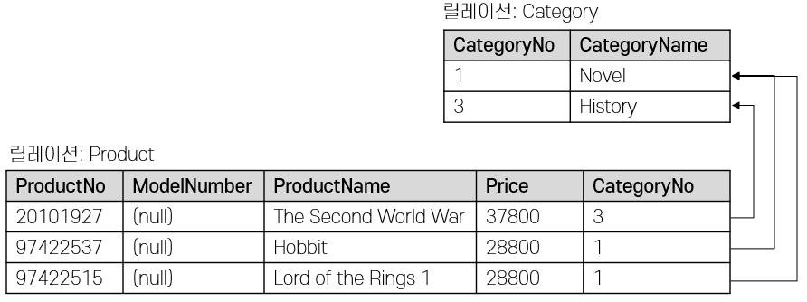

# Module 02

정형 데이터 vs 비정형 데이터

정형 : 틀이 정해져있다 → 데이터베이스 : `데이터 모델` 을 의미 →RDBMS (Relational DBMS)

## 관계 모델

- `관계 데이터 모델`
- 관계 논리식과 관계 대수식에 기반한 수학적 데이터 조회 및 저장
- 데이터베이스는 하나 이상의 릴레이션의 집합으로, **테이블 형식**으로 데이터 표현
- 데이터를 제어하는 **고수준의 언어**를 사용하여 데이터의 표현과 복잡한 질의를 쉽게 처리
- [**Codd’s 12 rules → RDBMS가 지켜야하는 조건 (13개, 0부터 시작)**](https://www.javatpoint.com/12-codds-rules)

## 릴레이션 스키마

- `개체 (Entity)` 와 개체의 특성을 나타내는 `속성(Attribute)`, `개체 간의 관계(Relation)`, `제약 조건(Constraint)`을 기술한 것
- 릴레이션 스키마 명세
    - 릴레이션 이름
    - `Field` 또는 `Column` 또는 `Attribute` 이름
    - 각 속성의 `Domain` 이름
    
    
    

## 도메인 (Domain)

- 하나의 속성이 가질 수 있는 동일한 유형의 원자값들의 집합
- 프로그래밍 언어 관점에서 필드의 **데이터 타입**을 의미

## 개체 무결성

- 한 개체는 릴레이션 내에서 다른 개체들과 명확히 구분되어야 함
- **키 제약조건 (Key Constraint)** - 개체 무결성 유지
    - **슈퍼 키(Super Key)** 슈퍼 키는 릴레이션에 존재하는, 유일성을 만족하는 필드들의 부분 집합입니다. 필드의 부분집합인 {학번, 이름}은 그 자체로 필드를 식별할 수 있습니다. 학번 필드가 투플을 유일하게 식별할 수 있기 때문입니다.
    - **후보 키(Candidate Key)** 학생 릴레이션에서 학번 필드 이외에도 로그인 필드 또한 키가 될 수 있습니다. 이와 같은 키들을 후보 키라고 합니다. 후보 키는 릴레이션에 존재하는 전체 필드의 부분 집합으로서, 유일성과 최소성을 만족해야 합니다. 키의 두 가지 조건을 만족하는 릴레이션 필드의 부분집합을 후보 키라고 합니다.
    - **기본 키(Primary Key)** 후보 키 중 하나를 지정하여 릴레이션 인스턴스 내에서 투플의 유일성을 식별할 수 있도록 지정된 키를 기본 키라고 합니다.
    

## 참조 무결성

- 한 릴레이션에 저장된 정보와 다른 릴레이션에 저장된 정보가 연결되는 경우가 대부분
- **외래 키 제약조건(Foreign Key Constraint)** 으로 참조 무결성을 유지
    - 한 릴레이션의 필드가 다른 릴레이션의 키를 참조
    - 참조하는 릴레이션의 데이터 변경에 따른 무결성 유지

**외래 키 (Foreign Key)**

- 한 릴레이션의 키 중에서 다른 릴레이션의 튜플을 유일하게 시결할 수 있는 키
- 한 릴레이션의 튜플에서 다른 릴레이션의 튜플을 참조하기 위해 이용