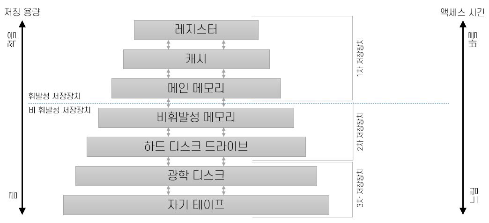

= Module 03: 디스크와 파일

* RDBMS에 데이터를 저장하면 디스크에 저장
* 데이터를 읽어온다 -> 메모리에 있는 데이터를 읽어온다.

> 데이터베이스가 쿼리를 실행한다면?

1. 사용자가 쿼리를 실행
2. 쿼리 옵티마이저가 실행계획을 수립 (최고의 효율을 내는 방법)
3. Relational Operator
4. Buffer Manager -> Buffer Pool

// 3. 해당 데이터들이 메모리에 존재하는지 확인 후 데이터를 읽어옴.

== 디스크와 파일 개요

== 기억장치 계층 구조

1. Register
* PC(Program Counter)
* IR(Instructor Register)
* MAR(Memory Address Register)
* MBR(Memory Buffer Register)

== HDD (Hard Disk Drive)
* 디스크 블록(Disk Block)이라고 하는 단위로 저장
* 블록은 하나 이상의 플래터(Platter)에서 트랙(track)이라는 동심원을 따라 배치
* 각 트랙은 섹터(Sector)로 나뉨

image::images/hdd.png[title=HDD]

== SSD (Solid State Drive)
* 플래시 메모리를 사용하여 저장
* 데이터 저장 방식 : 컨트롤러가 플래시 메모리의 어느 곳에 저장할지 결정하고 플래시 메모리의 물리적 주소를 지정한 후 데이터 저장

=== 디스크의 성능

*HDD*

* DBMS가 작업을 수행하려면 데이터는 주 기억장치에 있어야 함.
* 디스크와 주 기억장치 간 데이터 전송 단위는 블록 단위 -> 블록 내의 하나의 정보만 필요한 경우에도 블록 전체를 보내야 됨.
* 블록과 페이지 입출력은 데이터 위치에 좌우됨
* 접근 시간 = 탐색 시간 + 회전 지연 시간 + 전송 시간

*SSD*

* HDD와 다르게 탐색 지연 시간, 회전 지연 시간이 없어 전송 시간만 소요되므로 임의적 읽기에서도 일정한 응답 속도가 보장
* 쓰기의 경우 비어있는 공간이 없으면 공간을 초기화하고, 이 작업 시간 동안 해당 공간에 대한 I/O 작업이 대기 상태가 됨.

{empty} +

== 버퍼 관리자

=== 1. 버퍼 풀

> 가용한 주 기억장치 공간을 페이지라는 단위로 분할한 데이터 적재 공간

* `pin_count` : 누군가 page를 읽고 있다면 pin_count가 1이 되어 교체 대상이 되지 않음.
* `dirty` : 데이터를 업데이트 할 경우 dirty bit가 true로 설정됨.

=== 2. 버퍼 교체 전략

* LRU (Least Recently Used) : pin_count가 0인 프레임들에 대한 포인터로 큐를 생성
* Clock : LRU의 변형, 1부터 N 사이 값인 current 변수를 사용하여 교체용 페이지 선정
* FIFO (First In First Out), MRU(Most Recently Used), Random 등의 방식 사용

=== 3. 버퍼 관리 기법

* 운영체제의 가상 메모리와 DBMS의 버퍼 관리자는 매우 비슷
* DBMS는 페이지 참조 패턴을 운영체제 환경보다 더 정확히 예측해야 함. -> 참조 패턴을 예측할 수 있으므로 페이지 우선 적재 전략 사용할 수 있음.
* DBMS는 페이지를 디스크에 강제 출력할 수 있어야 함. -> 손상 복구를 위한 WAL 규약 실현할 수 있음.

> RID(Row ID) : 튜플을 식별하는데 사용되는 값으로 페이지 번호와 offset으로 구성

== 레코드 (Record)

=== 고정 길이 레코드
* 각 필드의 길이가 고정적이고 필드의 수도 고정된 레코드 형식
* 필드를 레코드에 연속적으로 저장

=== 가변 길이 레코드
* 필드의 길이가 가변적인 경우 해당 레코드의 길이가 가변적
* 필드를 분리자로 구분하여 연속적으로 저장
