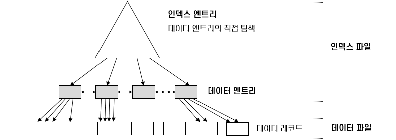

= Module 04. 파일 조직과 인덱스

== 비용 모델 (Cost Model)
[source]
----
[비용 측정]
B : 페이지 수
R : 페이지의 레코드 수
D : 디스크에 페이지를 쓰는 시간
C : 하나의 레코드 처리 시간
H : 레코드 해시함수 처리 시간
----

== 인덱스 (Index)
* 데이터 엔트리(Data Entry)들의 모임
* 연산의 속도를 높이기 위해 만드는 보조적 자료구조

=== 클러스터드 인덱스 (Clustered Index)
* 파일을 조직할 때 레코드의 순서를 파일에 대한 인덱스의 순서와 동일한 순서로 유지
* 파일의 재조직이 필요한 구조
* 파일이 동적으로 변하는 경우 유지 관리 오버헤드가 높다.

