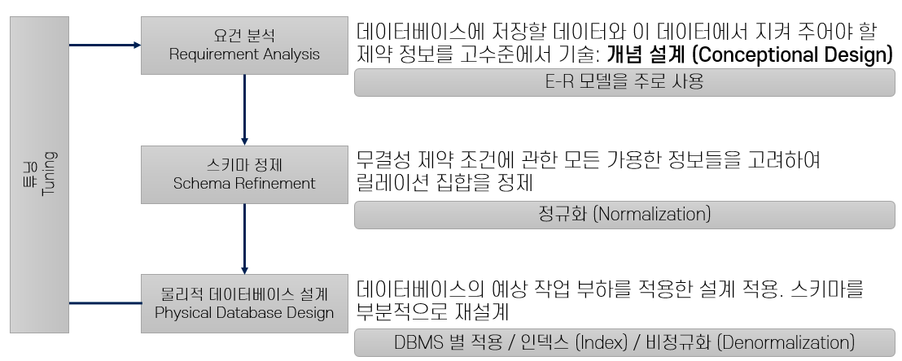

= Module 08. 개념적 설계와 ER 모델

== 데이터베이스 설계

1. 요건 분석 (Requirement Analysis)  : DB에 어떤 데이터가 저장되고, 어떤 제약조건을 가져야 하는지 분석
2. 스키마 정제 (Schema Refinement) : 정규화(Normalization)을 통해서 릴레이션 집합 정제

> 데이터베이스의 무결성 3가지 : 개체 무결성, 참조 무결성, 도메인 무결성

=== 개체 무결성
* KEY를 사용하여 개체를 식별
* 기본키를 구성하는 속성은 NULL 값이나 중복값을 가질 수 없다.

=== 참조 무결성
* 외래키 값은 NULL이거나 참조 릴레이션의 기본키 값과 동일해야 한다.
* 즉, 릴레이션은 참조할 수 없는 외래키 값을 가질 수 없다.

=== 도메인 무결성
* 속성의 값이 정의된 도메인에 속한 값이어야 한다.

{empty} +

== 개체 관계 데이터 모델
* 데이터를 `Entity`, `Attribute`, `Relationship` 3가지로 표현
** *Entity* : Java의 Class와 유사한 개념
** *Attribute* : Java Class의 필드와 유사한 개념
** *Relationship* : HAS-A 관계로 표현

== ER 모델을 자바 코드로 옮겨보자

==== 교수 클래스

[source,java]
----
public class Professor {
    int professorId;
    String name;
    int age;
    String grade;

    public Professor(int professorId, String name, int age, String grade) {
        this.professorId = professorId;
        this.name = name;
        this.age = age;
        this.grade = grade;
    }

    public void manageSubject(Subject subject) {
        SubjectParticipates<Professor> list = new SubjectParticipates<>();
        list.add(this);
        ...
    }

    public void startSubject(Subject subject) {
        ...
    }

}
----

==== 과제 클래스
[source,java]
----
import java.util.LocalDate;

public class Subject {
    int subjectID;
    String supportOrg;
    LocalDate startDate;
    LocalDate endDate;
}
----

==== 대학원생 클래스
[source,java]
----
public class Student {
    int studentID;
    String name;
    int age;
    String degree;
}
----

==== 과제 참여자 클래스
[source,java]
----
public class SubjectParticipates<T> {
    List<T> list = new ArrayList<>();

    public void add(T t) {
        this.list.add(t);
    }
}
----