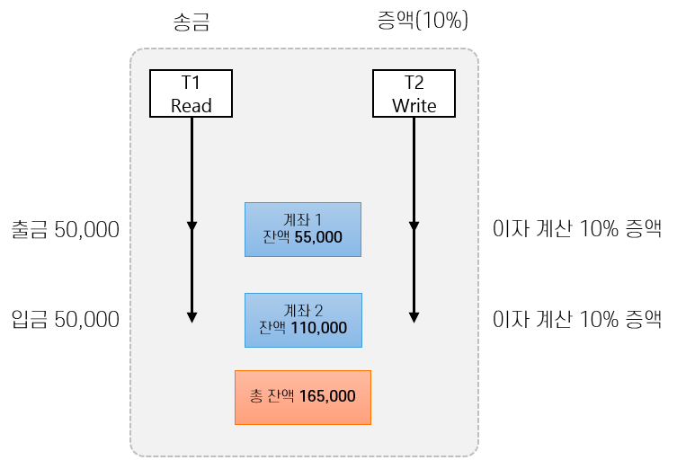
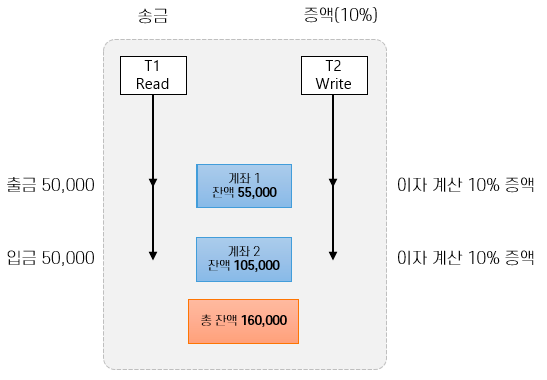
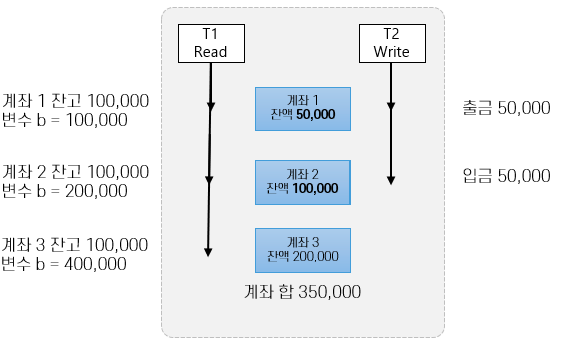

= Module 12: 병행성 제어

* DB에서의 공유 자원은 Record 뿐이다.
* Process Serialization (프로세스 직렬화) -> 공유 자원에 대한 접근을 제어
* 데이터베이스는 공유 자원에 접근하는 방식은 Read, Write 두 가지 방식이 있다.

> 데이터베이스에서의 프로세스는 *transaction* 이라고 한다.

== 트랜잭션 개요
* 데이터베이스 객체들에 대한 일련의 판독(Read) 또는 기록(Write)
** 판독 -> 디스크에서 버퍼풀의 프레임으로 페이징되고 그 값이 프로그램 변수로 복사됨
** 기록 -> 프레임의 객체 복사본이 수정된 후 디스크에 기록

* ACID
** Atomicity (원자성) : 부분적으로 실행되다가 중단되지 않음을 보장 -> All or Nothing
** Consistency (일관성) : 실행 완료가 되면 언제나 일관성 있는 데이터베이스 상태로 유지됨을 보장
** Isolation (고립성) : 트랜잭션 수행 시 다른 트랜잭션의 연산 작업이 끼어들지 못하도록 보장
** Durability (영속성) : 성공적으로 수행된 트랜잭션은 영구적으로 데이터베이스의 반영

* *트랜잭션* : 정보를 기록하거나 판독하는 단위

== 트랜잭션과 일관성
* 인터리빙(Interleaving)과 상관없이 순서대로 실행한 결과를 보장 -> 직렬화(Serialization)
** 격리성(Isolation) 만족
** 무결성 제약조건을 집행할 매커니즘을 제공

== 트랜잭션과 스케줄
* DBMS 관점에서 트랜잭션 하나는 단위 작업들의 나열 (action - read와 write)

* Shared lock :리소스를 다른 사용자가 동시에 읽을 수는 있지만, 쓰지는 못한다.
* Exclusive lock : 읽지도 쓰지도 못하게 잠그는 기법

== 일관성
* 직렬 가능성
* 교차 수행에 의한 이상
* 기록-판독 충돌 (WR Conflict)
* 판독-기록 충돌 (RW Conflict)
* 기록-기록 충돌 (WW Conflict)

=== 직렬 가능성
* 직렬 가능 스케줄
** 주어진 스케줄을 수행해서 나온 DB 인스턴스는 해당 트랜잭션들을 직렬 순서대로 수행해서 나온 DB 인스턴스와 동등
* 트랜잭션들을 똑같이 직렬로 수행하더라도 순서를 바꾸면 결과가 달라질 수 있음.
* Abort된 트랜잭션이 있는 스케줄까지는 포함하지 않음

== 교차 수행에 의한 일부 이상
* 트랜잭션 T1과 T2의 단위 작업이 충돌(Conflict)하는 경우
* 기록-판독 충돌 (WR Conflict)
* 판독-기록 충돌 (RW Conflict)
* 기록-기록 충돌 (WW Conflict)

=== 기록-판독 충돌
* 미완결된 데이터를 읽는 경우
* Dirty Read 발생!

=== 판독-기록 충돌
* 반복 불가능한 읽기를 수행하는 경우

=== 기록-기록 충돌
* 미 완결된 데이터를 덮어 쓰는 경우
* 맹목 기록(Blind Write)라고 부름 -> 덮어쓰기

== Lock
* Lock Mode
* Shared Lock Mode
* Exclusive Lock Mode
* Strict 2 Phase Lock

=== 잠금 관리
* 잠금 관리자(Lock Manager)를 제공
** 잠금 테이블과 트랜잭션 테이블을 유지
** 잠금 테이블 엔트리로 객체에 대한 잠금 정보 관리
* 잠금 요청과 잠금 해제 요청 구현

=== 교착 상태 (Deadlock)
* 두 트랜잭션이 잠금 해제를 기다리는 관계에 사이클이 생긴 경우
* 논리적으로 교착상태를 막을 수 있는 방법은 없음.
** 예방으로 프로세스를 막거나, 탐지로 교착상태를 검출하여 프로세스를 죽이는 방법밖에 없다.

==== 교착상태 예방
* 트랜잭션마다 우선순위를 부여해주고 우선순위가 낮은 트랜잭션은 높은 트랜잭션을 기다릴수 없도록하여 예방
* 타임 스탬프로 우선순위 지정
* 잠금 관리자는 두 가지 전략 중 하나를 사용
** 트랜잭션 Ti 가 잠금을 요청하고 트랜잭션 Tj 가
** Wait-Die : Ti 입장에서 자신의 우선순위가 높으면 기다리고 그렇지 않으면 철회
** Wound-Wait : Ti 입장에서 자신의 우선순위가 높으면 Tj를 철회, 그렇지 않으면 자신이 기다림

==== 교착상태 탐지
* Deadlock은 매우 드물게 발생, 몇 안되는 트랜잭션만 관련됨
* 발생 후 탐지해서 해결하는 것이 좋을 수 있다. -> DBMS는 주기적으로 점검
* 잠금 관리자는 Wait-for 그래프라는 자료구조를 유지하면서 교착상태 사이클 탐지

=== Isolation Level

> T : 트랜잭션

* READ UNCOMMITTED (LEVEL 0)
** T는 진행중인 트랜잭션이 만들어 놓은 변경도 판독 가능

* READ COMMITTED (LEVEL 1)
** T는 완결된 트랜잭션들이 만들어 놓은 변경만 판독 가능
** T가 판독하거나 기록한 값은 T가 종료된 후에 변경할 수 있으나, T가 판독한 Row는 다른 트랜잭션이 접근 가능

* REPEATABLE READ (LEVEL 2)
** T는 완결된 트랜잭션들이 만들어 놓은 변경만 판독
** T가 판독하거나 기록한 값은 T가 종료된 후에 변경할 수 있으나, Index Locking은 하지 않는다.

* SERIALIZABLE (LEVEL 3)
** T는 완결된 트랜잭션들이 만들어 놓은 변경만 판독
** T가 판독하거나 기록한 값은 T가 종료된 후에 변경할 수 있음.

[%header, cols=4, width=90%]
|===
|Level|Dirty Read|Non-Repeatable Read|Phantom
|READ UNCOMMITTED|가능성 있음|가능성있음|가능성있음
|READ COMMITTED|불가|가능성 있음|가능성 있음
|REPEATABLE READ|불가|불가|가능성 있음
|SERIALIZABLE|불가|불가|불가
|===

