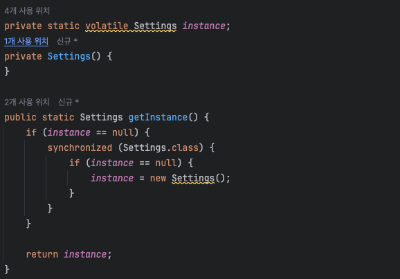

# 싱글톤(Singleton) 패턴
> 인스턴스를 오직 한개만 제공하는 클래스.

- 인스턴스를 오직 1개만 만들어서 제공하는 클래스가 필요

### 언제 사용하는가?
- 만약 게임의 설정화면이 여러 개가 존재한다면?..

### 특징
- 싱글톤 패턴은 new를 사용하지 않는다!
- private 생성자를 통해 생성을 못하게 막아버린다.
- 생성을 하지 않으므로 글로벌하게 접근할 수 있는 방법을 제공해야 한다.

### 문제점
- 멀티스레드 환경에서 싱글톤이 안전한가? -> 안전하지 않다..
- 멀티스레드에 안전하게 싱글톤을 만들어야 한다.

## 왜 Thread-safe하지 않을까?

- 위의 if문에 각각 다른 스레드가 들어갈 수 있다
- 따라서 Thread-safe하게 만들어야 한다.

### 해결 방법
1. `synchronized`
- `synchronized`를 사용해서 한 번에 한 스레드만 들어오게 할 수도 있다.
- 하지만 위의 방법은 lock을 사용하기 때문에 성능의 문제가 발생

2. `이른 초기화(eager initialization)`
- 이 방법도 thread-safe 하다.
- 하지만 미리 생성하는데 비용이 적다거나, 나중에 사용하지 않을 경우엔 쓸모가 없다

   
3. `double checked locking`
- jdk 1.5부터 동작

- 

4. `static inner 클래스`
- **권장하는 방법!**
- lazy loading이 가능해짐

---

## 싱글톤 패턴의 단점

- `TDD(Test Driven Development)`를 할 때 문제가 생김.
  - 단위 테스트는 테스트가 서로 독립적이어야 함.
  - 하지만, 싱글톤 패턴은 미리 생성된 하나의 인스턴스를 공유해서 사용
  - 독립적인 인스턴스를 만들기 어려움!

## 의존성 주입

- 모듈 간 결합을 강하게 만들 수 있다는 단점 또한 존재함.
- 이 떄 의존성 주입 (DI, Dependency Injection)을 통해 결합을 느슨하게 만들 수 있다.

### 의존성 주입의 장점은?

- 모듈들을 쉽게 교체할 수 있는 구조
  - 테스트하기 편해짐
  - 마이그레이션 또한 편해짐
- 모듈 간의 관계가 명확해짐

### 그렇다면 의존성 주입의 단점은?
- 모듈들이 더욱 더 분리되므로 클래스 수가 증가
  - 복잡성이 늘어남
  - 런타임 페널티가 생기기도 함.

> **의존성 주입 원칙**  
> 상위 모듈은 하위 모듈에서 어떠한 것도 가져오지 않아야 한다.  
> 또한, 둘 다 추상화에 의존해야 하며, 이 때 추상화는 세부 사항에 의존하지 말아야 한다.