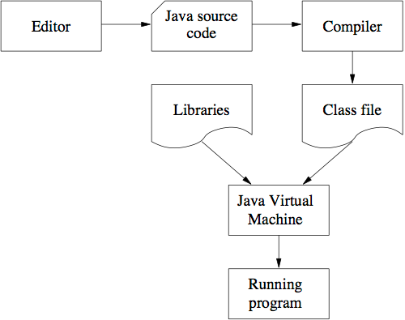
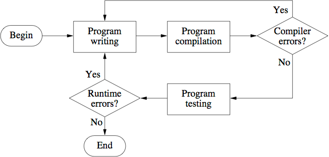

# Java 프로그램 작성, 컴파일 및 실행

## 1. 프로그램 작성
- Java 프로그램의 경우 파일 이름은 `Class Name.java`과 같은 규칙을 따른다.
- 여기서 Class Name은 프로그램에 정의된 클래스 이름 (ex. First.java)

## 2. 프로그램 편집
- 프로그램을 컴퓨터에서 직접 실행할 수 있는 일련의 명령으로 변환하려면 Java SDK(Java Standard Development Kit)이 필요하다.
- `javac Class Name.java` 명령어를 사용해서 컴파일한다.
- 컴파일을 하면 컴퓨터에서 직접 실행할 수 있는 명령이 포함된 ClassName.class라는 파일이 생성된다.
- ex. `javac First.java` -> `First.class` 파일 생성
> 여기서의 Java SDK는 JDK이다.

## 3. 컴파일된 프로그램 실행
- class 파일이 있을 때 실행할 수 있다.
- 실행 명령어: `java First`와 같이 클래스명을 작성한다.
- First 클래스의 Main method를 실행하여 화면에 출력한다.

```java
public class First {
    public static void main(String[] args) {
        System.out.println("This is my first java program");
    }
}
```

## 소스코드부터 프로그램 실행까지의 과정



## 참고사항
- Java Compiler는 컴퓨터에서 직접 실행할 수 있는 코드를 실행하지 않는다.
- `Byte Code`를 생성한다.
- 이러한 이유로 자바는 `platform independent`하다고 할 수 있다.
- 이러한 Byte Code를 해석해주는 `JVM(Java Virtual Machine)`을 사용해야 한다.

## The edit-compile-verify cycle
