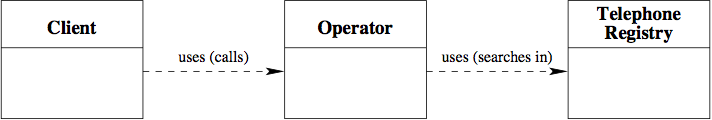

# Representation of the domain: objects

## objects
- 동일한 타입의 객체를 클래스로 그룹화
- 클래스 간의 관계 설정 (서로 다른 클래스의 객체가 서로 어떻게 연결되는지 구성한다.)
- 각 클래스에 속하는 객체의 속성을 구성한다.
- 클래스를 구현한다.

> 클래스와 클래스 간의 관계를 명시적으로 만들기 위해 `클래스 다이어그램`을 사용할 수 있다.

## Class Diagram
- 각 클래스는 클래스 이름을 포함하는 직사각형으로 표현
- 클래스 간의 관계는 화살표로 표시 (화살표: 클래스 간의 관계를 나타냄)
- 클래스의 속성은 표시되지 않음. 
  
> ex. **CallCenter - Class Diagram**  
> 

