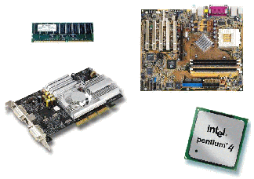
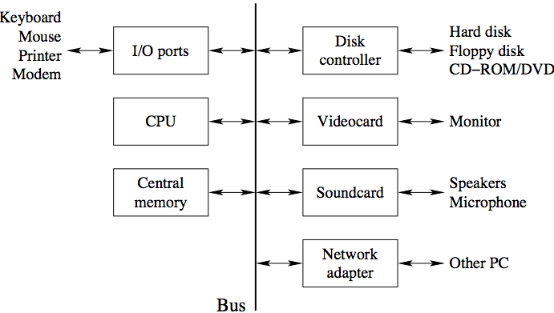

# 컴퓨터란 무엇인가?

- 하드웨어
    - 프로세서
    - 메모리
    - I/O units

- 어떻게 컴퓨터는 동작하는가?
    - 매우 간단한 명령어를 실행한다.
    - 엄청 빠르게 실행한다.
    - 프로그래밍되어야 한다. (컴퓨터가 실제로 수행하는 작업을 특성화하는 것, 소프트웨어이자 프로그램)


## Components of a computer



## Simplified Computer Architecture



## Languages for programming a computer

1. Machine Language (기계어)
    -  21 40 16 100 163 240
2. Assembler Language (어셈블리어)
    ```
    iload inRate
    bipush 100
    if_icmpgt inError
    ```
3. High level programming langugaes 
    ```
    if (intRate > 100) ...
    ```

