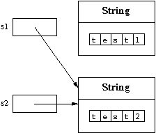
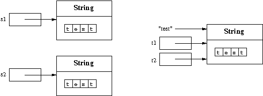

# 생성자 호출
새로운 객체 생성은 `생성자`라 불리는 특별한 메서드를 호출하여 수행

- `new ClassName(Parameter)`
- 생성자 오버로딩: 특정 클래스에는 매개변수의 개수/다른 유형에 따라 여러 생성자를 가질 수 있음.

```java
public class Hello {
    public static void main(String[] args) {
        String s = new String("Hello");
        System.out.println(s);
    }
}
```
- s는 String의 인스턴스
- "Hello"라는 문자열을 나타내는 새 객체가 생성됨
- 객체에 대한 참조는 변수 s에 할당


## 빈 문자열
```java
String emptyString = new String();
```
- 빈 문자열은 길이가 0, 리터럴 ""로 표시할 수 있다.
- 주의: 빈 문자열과 null은 다르다!

## 객체의 접근성
```java
String s1 = new String("test1");
String s2 = new String("test2");
s1 = s2;
```
- s1의 참조를 s2도 참조하도록 대입(=)을 하였기 때문에 동일한 객체를 참조
- 
> **자바에서는 JVM이 garbage collection을 수행하여 사용하지 않는 메모리를 자동으로 회수**  
> 1. 더 이상 어떤 변수에도 참조되지 않는 "test1"이라는 문자열 객체는 가비지 컬렉션의 대상이 된다.
> 2. JVM의 가비지 컬렉터는 정기적으로 실행되거나 힙 메모리가 부족할 때 실행되어 사용하지 않는 객체를 반환
> 3. "test1" 문자열 객체는 힙 메모리에서 제거

## 객체에 대한 참조
다음과 같은 코드를 살펴보자
```java
String s1 = new String("test");
String s2 = new String("test");
String t1 = "test";
String t2 = "test";
```


- s1, s2는 new로 새로운 객체를 할당한 것
- t1, t2는 같은 객체를 참조한다.
