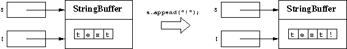

# 가변 객체

String과 매우 유사하지만 인스턴스가 변경 가능한 객체인 클래스 `StringBuffer`, `StringBuilder`가 존재

## side-effect(부작용)
가변 객체는 자신의 상태를 수정할 수 있어야 한다.  
이러한 수정을 `side-effect`라고 한다.
```java
public class SideEffect {
    public static void main(String[] args) {
        StringBuffer s = new StringBuffer("test");
        StringBuffer t;
        t = s;
        s.append("!");
    }
}
```
- 위와 같은 코드를 작성하면 어떻게 될까?
- s와 t는 모두 같은 객체를 참조한다.


