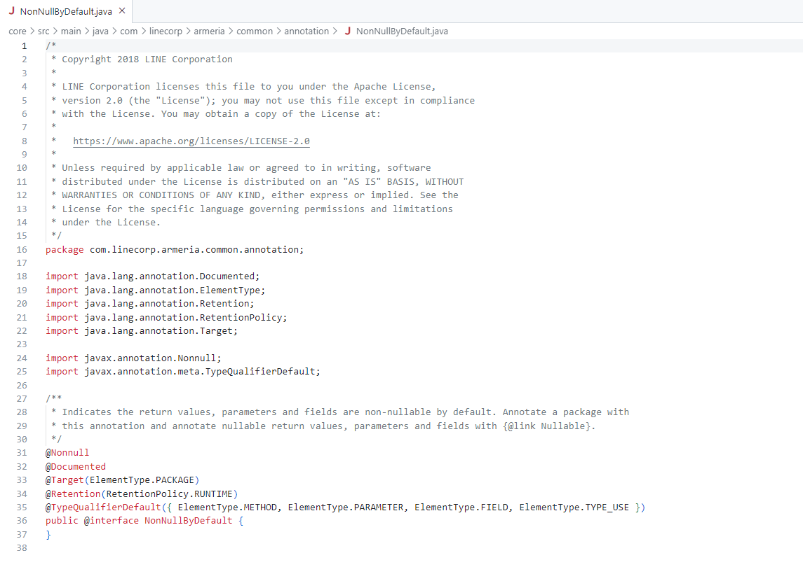

# Java에서 null을 다스리는 방법

> [Java 에서 null 을 다스리는 법  - Trustin Lee](https://www.youtube.com/live/oJpVeKKrgKI?si=vnBO6fx2sdMQU21l)
>
> Netty, Armeria로 잘 알려진 이희승(Trustin) 개발자님이 알려주시는 영상을 보고 정리하였습니다.


## 1. Null

Java에서 `null`은 값이 부재하다 라는 뜻입니다.

```java
Object obj = null;

obj.doSomething();
```

위와 같은 코드에서는 `obj.doSomething()`에서 *NPE(NullPointerException)* 이 발생하겠죠?

그러므로, null을 없애는게 가장 좋은 방법이라고 합니다.

### String에서 null을 다루는 방법

```java
String str = "";
```
String같은 경우 빈 문자열로 대체하는 경우가 많아요.

많은 Util 함수들을 보다보면, `nullOrEmpty();`와 같이 동일하게 처리하기도 합니다.

```java
firstNonNull(a, "");
```

위와 같은 방법으로 의도적으로 null 대신 빈 문자열을 넣는 함수를 호출하는 방법도 존재합니다.


## 2. Optional

> Scala라는 언어의 영향을 받아 만들어진 Optional을 살펴봅시다.

```java
Optional<T> optioanl

// 만약 'User'라는 객체를 Optional로 받는다고 해보자
Optional<User> optional = Optional.ofNullable(...);

// optional은 값이 존재하는지 확인해야 함.
optional.ifPresent(v -> ...);
```

### Optioanl의 단점
- Optional 자체가 객체
  - Escape Analysis와 같은 방법으로 최적화
  - Stack에 저장하여 GC 대상이 되지 않는 방법!
  - Optimize issue
- 그래서 null이 없어진거야?.. 
- Optional은 Parameter로 넘기면 안된다.


## 3. 최근 트렌드

**Annotation**을 통한 정적 분석을 사용하자 !

1. `@NotNull`
2. `@Nullable`

위의 어노테이션을 통해 컴파일러나 개발자에게 정보를 주는 형태로 점차 변경되고 있음.

```java
@NotNull Y method(@Nullable X x)
```

위와 같이 메서드를 작성할 수도 있다는 것이다.

> Nullable 하다면 null일 수도, not null일 수도 있는데?..

이러한 문제를 해결하기 위해 대다수 프로젝트가 `Not Null by Default`라는 개념을 기본으로 생각한다.

_ex. [line - armeria](https://github.com/line/armeria)_




하지만, Java에서 Null을 어떻게 다루라는 표준이 존재하지 않는다.
따라서, 각 프로젝트마다 `@Nullable`이라는 어노테이션을 정의해놓고 사용하는 경우가 많다.


> **정적 분석 도구**
>
> intellij의 inspection이 null이 들어가지 말아야 할 곳에 넣을 경우 사용자에게 알려주게 된다.


### 주의할 점

```java

class A {

    @Nullable
    String foo();
}

class B extends A {

    @Nonnull
    String foo();
}

class C extends B {

    @Nullable
    String foo();
}

```

위와 같이 Contract가 깨지는 코드가 작성되지 않도록 주의해야 합니다.


## 4. uber - NullAway

> [NullAway - Github](https://github.com/uber/NullAway)  
> [Error Prone - Github](https://github.com/google/error-prone)

Java Compiler에 Error Prone이라는 플러그인을 넣어주고, 해당 Error Prone에 NullAway 플러그인을 통해 Build를 할 때 Null을 Check 할 수 있다.

해당 내용은 깃허브를 참고해서 보면 더 좋을 것 같아요.


---

[Parameter로 null이 들어온다면 어떻게 처리해야될까?](https://velog.io/@f1v3/IllegalArgumentException-VS-NullPointerException) 에 대해서 고민을 했었던 내용과, 프로젝트를 진행하면서 Null 처리에 대해 고민했던 경험이 있었는데 어떤 방식으로, 어떻게 처리하는게 좋을지 조금이나마 알 수 있었습니다.