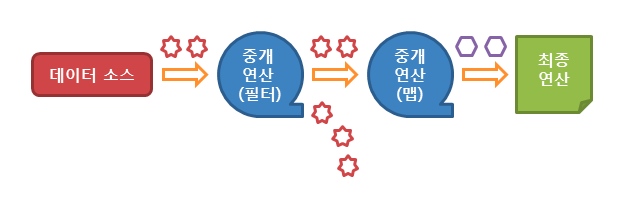

== Iterator

== Stream API

link:https://www.tcpschool.com/java/java_stream_concept[TCP SCHOOL]

=== Stream API의 특징
1. 스트림은 외부 반복을 통해 작업하는 컬렉션과는 달리 내부 반복(iternal iteration)을 통해 작업을 수행
2. 스트림은 재사용이 가능한 컬렉션과는 달리 단 한 번만 사용할 수 있다.
3. 스트림은 *원본 데이터를 변경하지 않는다.*
4. 스트림의 연산은 **filter-map 기반의 API를 사용** -> 지연(lazy) 연산을 통해 성능 최적화
5. parallelStream() 메소드를 통해 병렬 처리 지원

_아래의 그림과 같은 과정으로 동작_

=== Stream 생성

컬렉션
[source,java]
----
List<Integer> list = new ArrayList<>();

Stream<Integer> stream = list.stream();
stream.forEach(System.out::println);
----

배열
[source, java]
----
String[] arr = {"four", "two", "three", "one"};

Stream<String> stream1 = Arrays.stream(arr);
stream1.forEach(x -> System.out.print(x + " "));

// index 1부터 3 이전의 값까지만
Stream<String> stream2 = Arrays.stream(arr, 1, 3);
stream2.forEach(x -> System.out.print(x + " "));
----

가변 매개변수
[source, java]
----
Stream<Double> stream = Stream.of(4.2, 2.5, 3.1, 1.9);

stream.forEach(System.out::println);
----

지정된 범위의 연속된 정수
[source,java]
----
IntStream stream1 = IntStream.range(1, 4);
stream1.forEach(x -> System.out.print(x + " "));
System.out.println();

IntStream stream2 = IntStream.rangeClosed(1, 4);
stream2.forEach(x -> System.out.print(x + " "));
----

특정 타입의 난수들
[source,java]
----
System.out.println("[int]");
IntStream intStream = new Random().ints(4);
intStream.forEach(System.out::println);

System.out.println("\n[long]");
LongStream longStream = new Random().longs(4);
longStream.forEach(System.out::println);

System.out.println("\n[double]");
DoubleStream doubleStream = new Random().doubles(4);
doubleStream.forEach(System.out::println);
----

람다 표현식
[source,java]
----
IntStream stream = IntStream.iterate(2, n -> n + 2);
stream.filter(n ->  n > 0 && n < 100).forEach(System.out::println);
----

=== Stream의 중개 연산

1. 스트림 필터링: filter(), distinct()
2. 스트림 변환: map(), flatMap()
3. 스트림 제한: limit(), skip()
4. 스트림 정렬: sorted()
5. 스트림 연산 결과 확인: peek()
